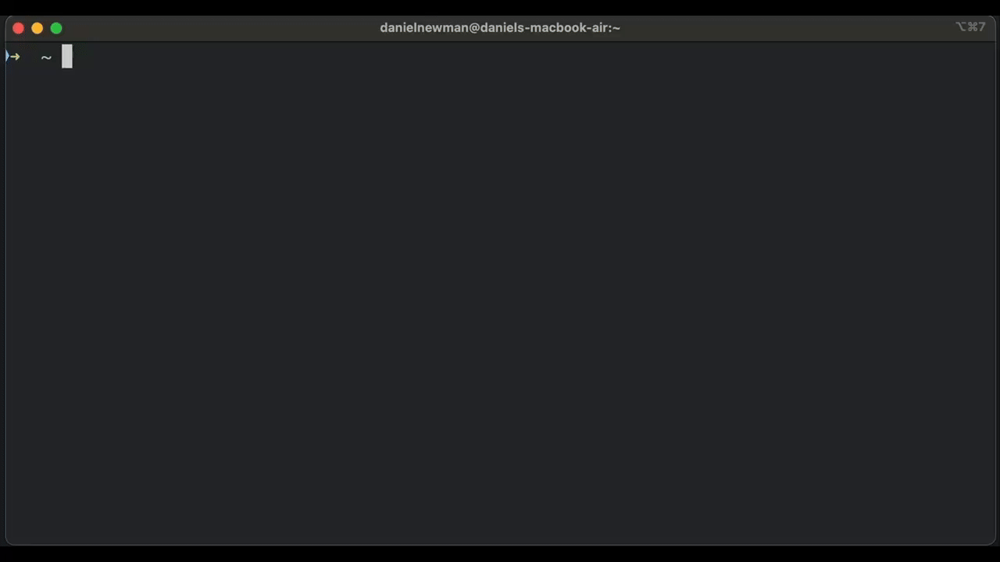
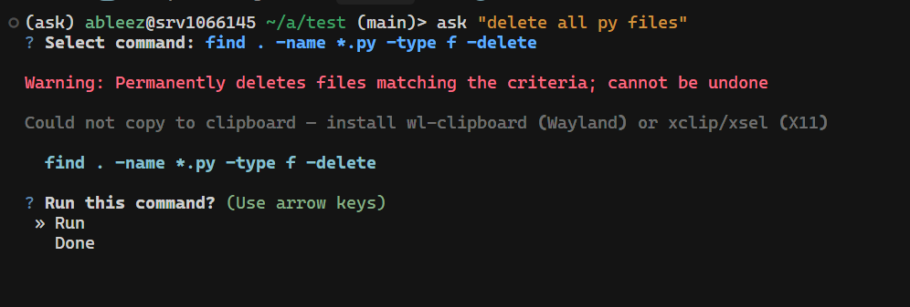
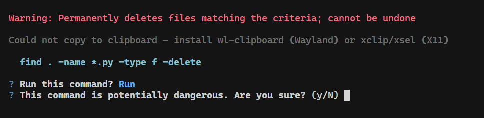

# Ask

[](https://pypi.org/project/ask/) [](https://opensource.org/licenses/MIT)

Terminal commands from natural language.

---

## Demo



---

## Install

```bash
pip install astexlabs-ask
```

Configure (optional): `ask --setup`. Works offline in **local mode** with no API key.

---

## Use cases

| Use case | Example |
|----------|---------|
| Find files | `ask 'find .py files modified in the last 24 hours'` |
| Search in files | `ask 'search for TODO in js files'` |
| Processes | `ask 'show running python processes'` |
| Disk & system | `ask 'show disk usage'` / `ask 'show memory usage'` |
| Git | `ask 'show uncommitted changes'` |
| Network | `ask 'check if google.com is reachable'` |

Interactive: run `ask` with no arguments.

---

## Safety

Commands are suggested by an LLM or a local parser; dangerous ones are flagged. Always review before running.

| |
|:--:|
|  |
|  |

---

## Providers

OpenAI · Google Gemini · [Ollama](https://ollama.com/) (local) · Azure OpenAI — set via `ask --config`.

---

[Contributing](CONTRIBUTING.md) · [MIT License](LICENSE)
